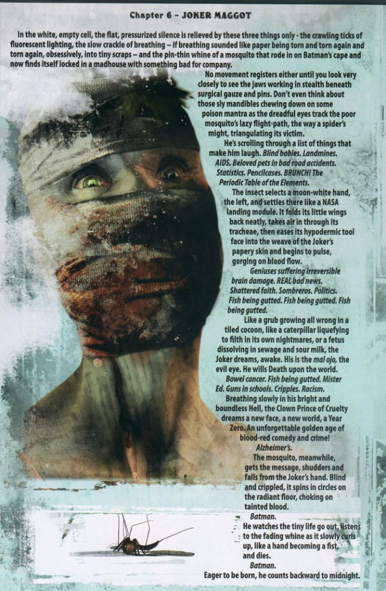

There's a pretty good definition of comics out there in the philosophy of comics literature.

> **Hayman-Pratt Pictorial Narrative Definition**: X is a comic if and only if x is a sequence of discrete, juxtaposed pictures that comprise a narrative, either in their own right or when combined with text **(Hayman and Pratt 2005, 423)**

Busiek [isn't the first](https://twitter.com/KurtBusiek/status/884637332351078400) (and won't be the last!) to suggest that comics can happen without pictures. Without text, I think we're all in agreement that they are (though R.C. Harvey has been pushing an amorphous definition for _years_ that leans on the importance of both art and text being present). Busiek [even wheels out](https://twitter.com/KurtBusiek/status/884643372148838400) the tried-and-true _Alpha Flight_ issue wherein a fight occurs among consecutive white panels. Busiek thinks this is "no traditional drawing".

Sure, ok. I guess blank white space is not "traditional drawing". But not all of this issue occurs in white panels. Sequences within a comic gain meaning from the sequences before and after them. Just as an individual panel does not a comic make, nor does it break. Even if the entire story were in black, though, representing a conversation between two friends in the dark before they fall asleep, you would still have a comic. Just because there is not any proper "draftsmanship" does not mean there is not any art: if a black panel represents darkness, then there you go.

If it is sufficient to intend, in good faith, for something to be a comic, that is one thing. I am not sympathetic to that particular argument, but it's different from what Busiek and many others often hand-wavingly suggest about the medium. It's "story-driven". Sure, but a story is not a prime mover; something must comprise the narrative, as sentences do in prose. And notice I say _sentences_: narrative, much like our speech, starts with big syntactic pieces and works its way down. A jumble of words is not a story because those words must come together to have meaning, and then those meaningful units must compose on a higher level to depict some series of events. Similarly, a bundle of random images is not a comic.

Where I think there is looseness in our definition or understanding is at the narrative level. What really is a narrative, after all? I'm not always sure. Event-based definitions ("A happened, then B happened, Bam! You have a story.") are fine, but there are plenty of stories I can think of where the events are strewn about and the story's impact is more evocative than demonstrative. Poetry comics are certainly comics, and almost none of the best ones have a narrative. They have a theme, often (not even that, many times) and manage to play up juxtaposition of word-image or image-image in ways only comics allow you to do. It's likely a more felicitous (and difficult to nail down) definition lies in the neighborhood of "that which expresses meaning through deliberate juxtaposition of images, with or without the aid of text."

Of course, this probably drags in too much, but the common thread to me no matter what is the emphasis in all good definitions of picture over text. Text augments; text is in fact, essential to certain _pieces_ of any given pictorial narrative; however, without images, what you have is a different language. It is a non-visual one. If you were to place a word in several panels, however, with borders and gutters and all, and call that a comic, I might agree with you! Panel borders, after all, are art! Gutters are a deliberate artistic choice! 

The trick here isn't to be right. I like rigorous definitions because people are a little too inexact a little too often.
The trick, rather, is to abandon loose words like "drawings" or "art" in these conversations, as if only such general things make each individual comic the very work that it is. Color has meaning; the thickness of a panel border has meaning; the font, the slant of the font, and that font in conjunction with anything else around it has, inherits, and generates meaning. It's all very fucking cool.

And again, not much of this matters if your answer is "well, if they say it's a comic...", since... well, that's pretty much that! But consider that there are almost certainly some things that you would not consider a comic if you were told that they were. You would push back if someone handed you _War and Peace_ and told you it was a comic. And I think there are legitimate, non-trivial reasons why that's the case.

So let's talk about that instead of hand-waving.
## Additional Reading

If you can somehow get your hands on it (I may be able to help if you are interested and DM me) Roy T. Cook wrote a little ditty “Do Comics Require Picture? Or Why Batman #663 is a Comic.” from The Journal of Aesthetics and Art Criticism 69, no. 3 (Summer 2011), pages 285-296. I happen to think the answer is "Yes They Do, and No, It Isn't", but it's worth a read as it is a rigorous philosophical attempt to frame the ontology of comics in a way that allows non-pictorial elements to be comics. I also have an extensive response buried in my thesis, which I can also send any interested readers.
