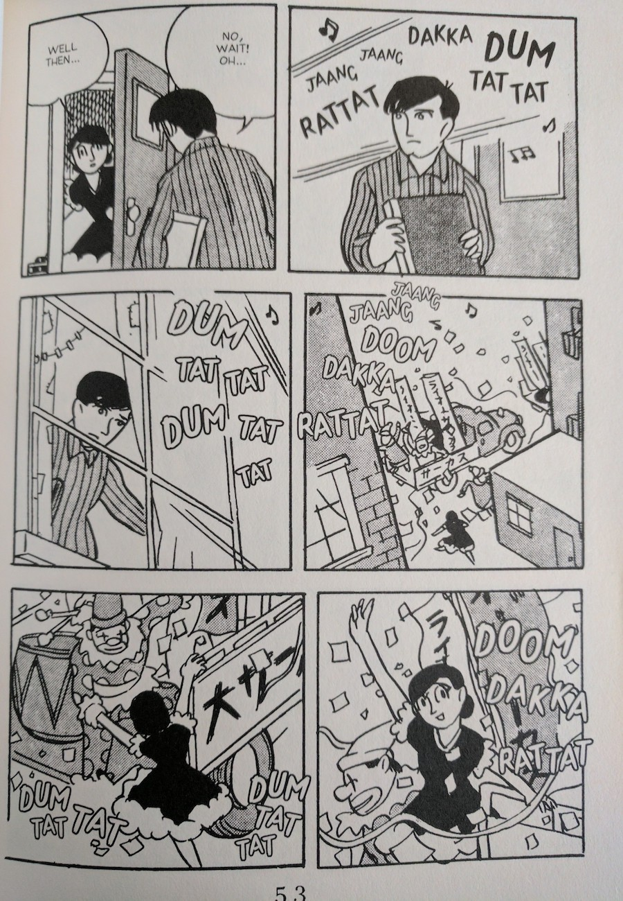
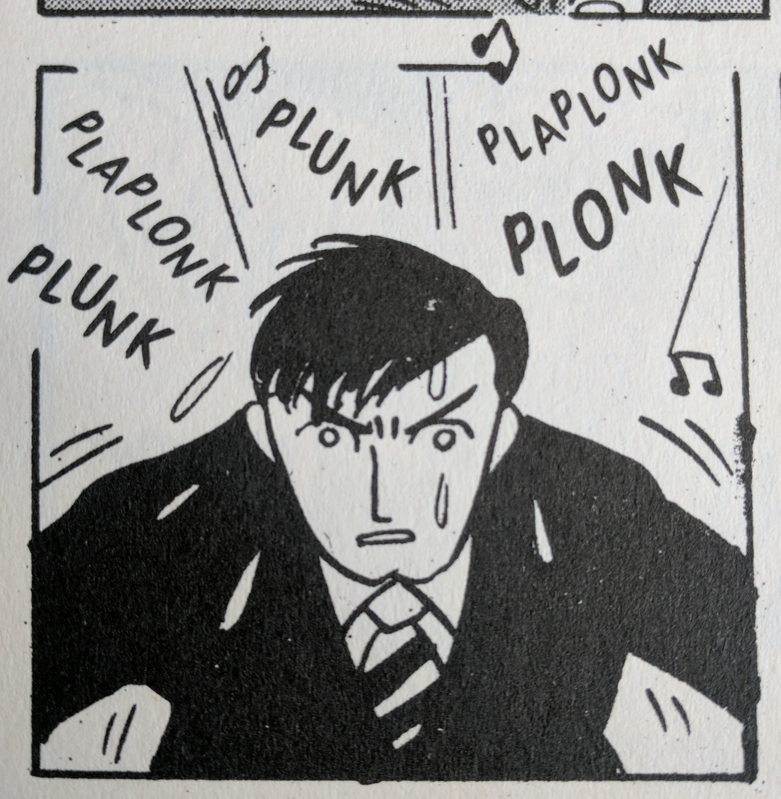
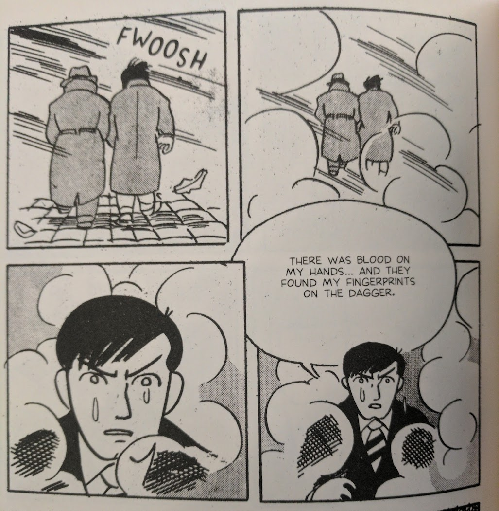
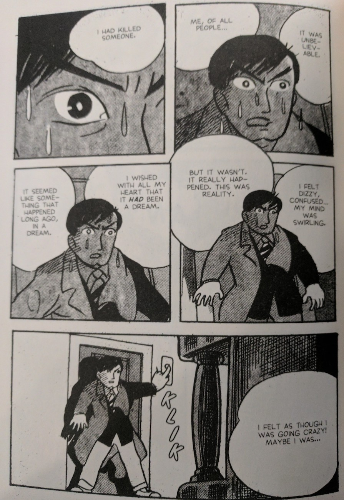

Tatsumi's thoughts about _Black Blizzard_ as a work are pretty telling.

> [B]ringing this work out as a book now is like exposing something shameful and private from my past that I'd rather keep hidden from sight.

In the quoted interview (with Adrian Tomine, featured in the back of D&Q's adaptation), Tomine quickly and gently (and correctly) rebukes Tatsumi for being too hard on his work.

But the pace at which Tatsumi put this book together (20 days!!!) often shows. _Black Blizzard_ is straight out of a noir movie that sounds like it was translated from English into Japanese and then back again. Of course, this book was never meant to sit on anybody's shelf: it was a rental manga at a time when the industry was booming and Tatsumi was cranking literally dozens of books out. That's not to say the work is objectively at a lower standard; yet, it is not as if we can divorce ourselves from the expectations we have of books that we pay for and re-read. Our disposition towards books is entirely different than someone's disposition would have been towards a _rental_ book in 1950's Japan.

That said, the book didn't even really do well with readers back then. The main demographic that seemed taken by Tatsumi's work in this case were his peers, and I can understand why. The book is a pretty early example of a creator who wasn't named "Tezuka" adapting essential elements of cinema in interesting ways. Still, the impact of these innovations was often limited to individual sequences, and thus benefits someone with an eye towards dissecting the work, rather than someone who is just interested in the story itself. Tatsumi wasn't yet comfortable enough with the tricks of the trade to get them to work consistently throughout, and the result is something charming and curious in spite of overall execution.

Notice the focus on the main character's expression here. Notice just how much this panel is _about_ what he is feeling, and how it is represented in various ways: his expression, the sweat drops coming off of him, the frantic lettering and the kinds of sounds it entails if you imagine somebody at a piano, the fact that the frantic lettering penetrates the sanctity of the panel, and that pair of eight notes that is dangerously close to the panel above.  _Black Blizzard_ was beloved by Tatsumi's colleagues because it represented a sharp shift in focus from mere storytelling or draftstmanship towards the cinematic and the outright dramatic in exactly this manner.

Admittedly, my favorite sequence in the book is the top image of this piece. The main character meets the love of his life because he dropped his music and she brought it to him... in the _middle of a fucking parade!_ The whole thing is just so goofy, despite how central it is to the story. Something about the final image of the woman on the float looking back gave me _very_ strong Satoshi Kon vibes. It's an anachronism, I know, but this kind of goofy earnestness is a surprisingly poignant vehicle in a lot of more modern Japanese media.

My unironic favorite part is the above sequence, where the main character disappears into the fog of the night with his arresting officer and then fades in to a similar cloudy scene, where the smoke is being caused by the nearby fire as he recounts his tale to a fellow escaped convict. The cinematic and the dramatic are especially evident in this scene: again, character expressions have entire panels dedicated to them. In addition, I can't think of something much more cinema-specific than trenchcoated figures walking off into a foggy distance. The other star are the diagonal lines adding texture to the outdoor scene. That kind of explicit ambient work was yet another way Tatsumi infused particular shots with drama.

I can't get over the second to that third panel (note: in case you haven't figured it out, this manga is flipped and reads like Western comics, left to right). It is a sudden transition but the focus on expression and the environmental elements carry the steady beat of the first two panels into a crescendo that is simultaneously loud and serene. It is the culmination of everything up to that point in the book, and yet when you see what all of that adds up to for the main character--when you are faced with _only_ what it means to him--a quiet penetrates the page, and the exposition in the next panel feels like it's being delivered not as plot details but as the lived experience of a man whose life has been shattered.

Although this sequence works, and beautifully so, its power is in its simplicity, and too many sequences delivered as such would make the book feel like a storyboard. Ironically, _Black Blizzard_ **doesn't** read like storyboards on the whole. While the narrative is well-paced, Tatsumi often seems unsure of how to vary the beats as they are presented visually. At one point, the last panel before a page turn is the exact same as the first panel after the page turn, and it's jarringly unpleasant.  _Black Blizzard_ is best understood as a mixed bag of sore thumbs and innovative flourishes held together by a competent storyteller paying his dues.

