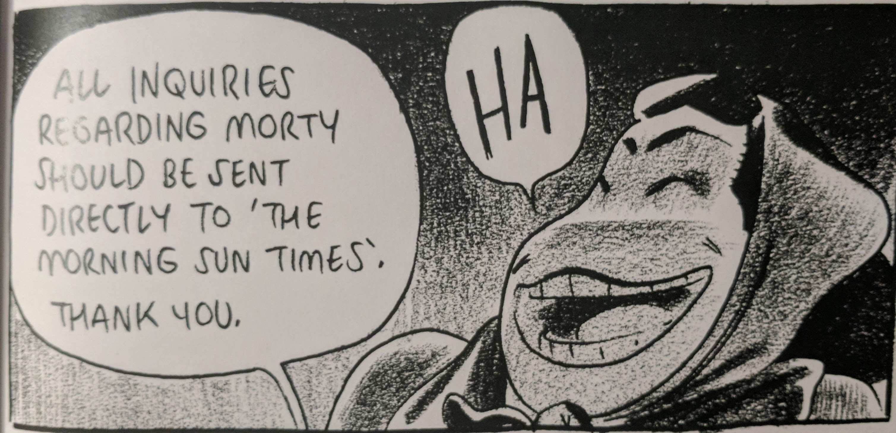
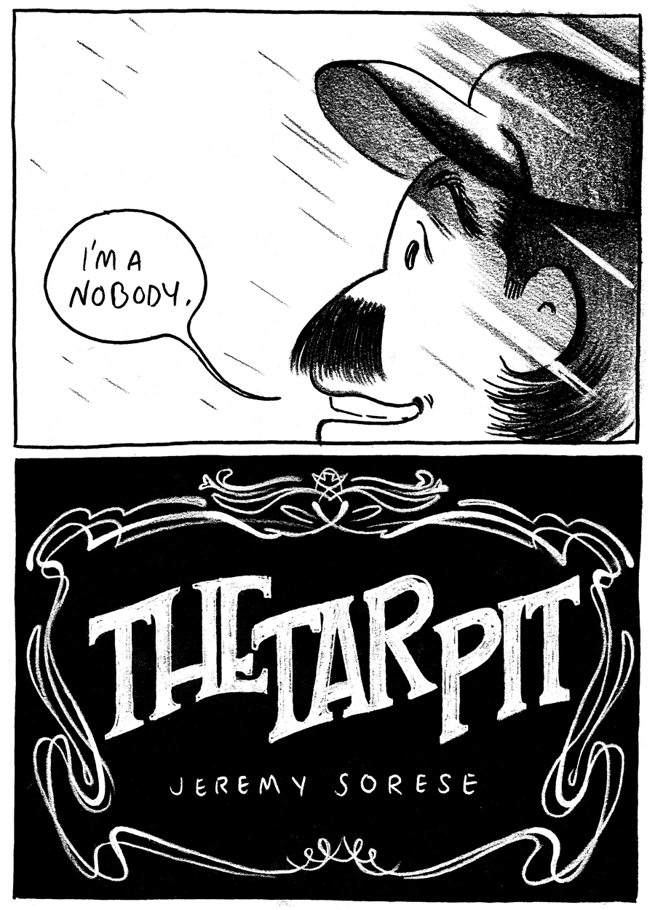
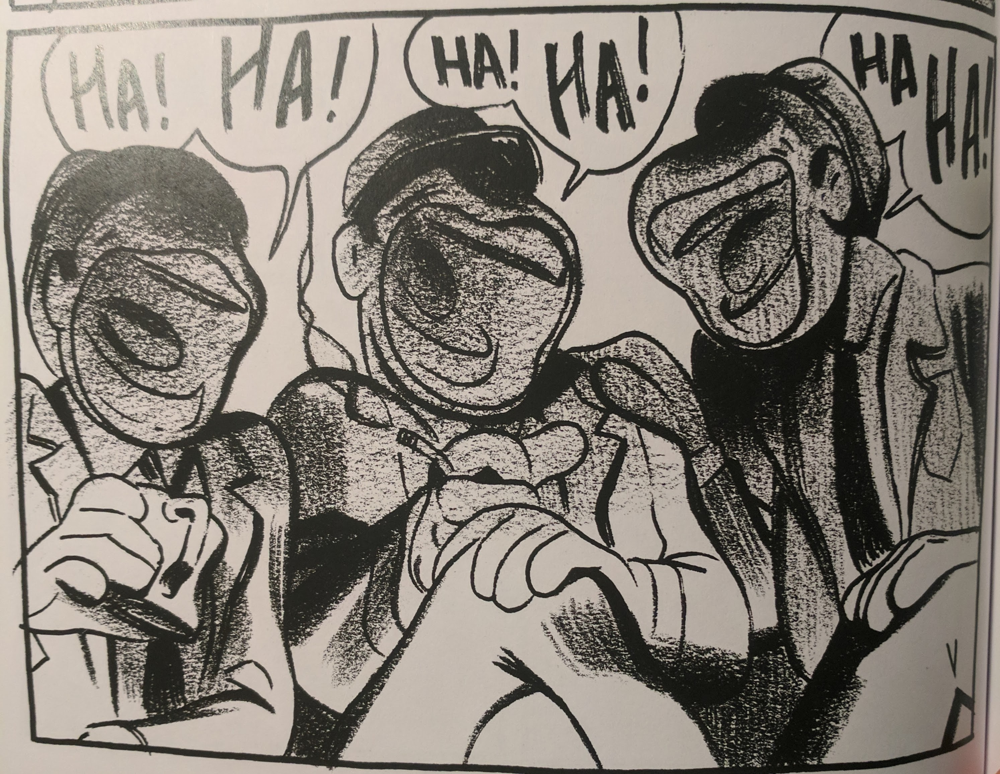
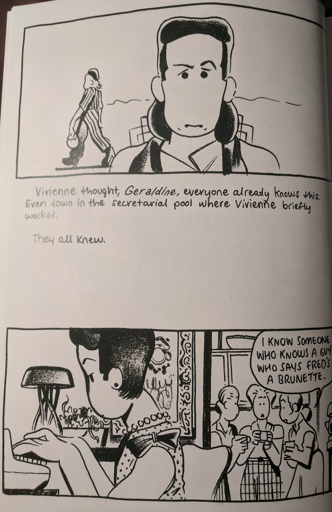

---
title: "Is That Not Kosher?"
layout: post
date: "2017-08-24T00:24:00.284-04"
path: "/posts/6"
itemTitle: "The Tar Pit"
itemAuthor: "Jeremy Sorese"
itemPublisher: "ShortBox"
itemType: "Book"
category: "comics"
description: "Both uneven and brave, The Tar Pit is a colorful cross-section of homophobia in fits and starts."
indexImage: "the_tar_pit.png"
draft: false
--- 

(**Note:** This is my first time reviewing something so new so soon, so I'm going to give a fair warning about spoilers. This is the only time I'm going to do this. You can assume if I write about something here, I'm just going to dive in.)

"Homophobia" is a wonderful term because of the way in which it evinces the psychology of the entire enterprise of being repulsed by homosexuals. It is a condition, one best understood as an _affliction_, where the real victim is the hater: one who would fear someone, as "-phobia" suggests, irrationally. We do not have a term like this that we apply often for individual racism and sexism. While perhaps we should, these things come in different flavors, and there truly is a particular shadow that falls on the person who physically cannot sit in proximity of a gay couple. There is an immediacy to exactly how petty and pathetic this person is, and rarely do people render their discomforts so...

So _performatively_.

Enter _The Tar Pit_, Jeremy Sorese's tale (commissioned by Zainab Akhtar's excellent and inspirational ShortBox project) of a young actress playing beard to two very famous, very in love, very closeted gay actors. The reader enters at a point in which the actress, Vivienne, appears to have tired of Burt and Fred's lifestyle, which is often punctuated by intense bickering. We quickly find out, however, that there is more to Vivienne's trepidations.

_The Tar Pit_ immediately grabs the reader with its size: a perfect bound A4 (that's ~8x11) book sticks out in any pile of mini comics, especially with front and back covers that are this stylish.  If you imagine the following prelude page in full size, you get a pretty good idea of the first impression this book makes.

I adore the top panel of this page because of the number of layers that Sorese is unpacking in one spot, and all before we even get to the page with a Copyright on it. Morty, a reporter and (as we find out later) also gay, is the catalyst in altering the lives of Vivienne, Burt, and Fred. He _is_, in fact, a somebody in his impact on her life, but not just in terms of altering its course: his very existence as a gay male is this sustained affront to an irrational disgust Vivienne has been nurturing within.

And that's why I like the choice to shine the light on him here. With the way his head is cut off as he looks up at the taller Vivienne, and with the light lines coming down at that particular angle across panels, Morty practically looks like he's part of some kind of new Assumption.  This is especially notable because when we see Morty's full encounter with Vivienne later on, it is in the dead of night as she looks for Bunny, the escaped dog. Those scenes are characterized by a loose charcoal that follows Vivienne and Morty into a diner, where her homophobia is revealed, as laughing gay men in the diner seen through Vivienne's eyes briefly comprise a nightmarish scene. Shining the light on Morty here in the prelude thus strikes the exact same "we're not going anywhere, bitch" tone as the book's final page, albeit much more subtly.

The sustained dark tones, even as the two character move indoors, coupled with pacing of the ensuing converation, lead to a satisfying crescendo that makes Vivienne's phobia palpable. Sorese renders her response to the situation as dramatic, abrupt, and truly frantic in a fashion befitting a fear bordering on disorder. Just one page--one _panel_, even--prior to hearing that Morty was gay, Vivienne was all smiles.

The frantic diner sequence is the climax of the story, which begets a steady wind-down featuring heavier prose and striking color work on each of the remaining pages, usually with only a single major panel. 

The prose throughout is punctuated with wry accounts of the roles that actresses get--"Mother of two growing boys, owner of a finicky cat"--and by the end I had some concern for how this may have tipped a key balance in the book itself. While Vivienne is in some ways a tragic character for whom we cannot help but feel some sympathy, the nature of the diner sequence does well to underscore that even if we understand her own personal struggles, and even if we think Fred and Burt were not the best people, Vivienne, Fred, and Burt were all grown-ass adults. If people want to be shitty, you have no obligation to stick around. And, on an important flip-side, there is no real excuse for internalizing any circumstances and projecting them onto millions of human beings as if they only exist to be your own personal horror show.

These wry comments, right around round three of the bit, tip this balance of understanding in the direction of the sardonic. The sporadic elbow-jab of "actresses have it rough, lol," while true, is a weird departure from the tone of the book, which is already a little wobbly, because the pacing in the book sort of accordions: you can feel it squeeze together as it reaches the climax, and a slow release towards the end begets a single drawn out note with just a little bend to it.

Part of this feels like it's due to _The Tar Pit's_ dimensions, or at least the way the excessive space is or is not utilized. From the very first page, because of the size of the panels and the freehand prose lettering, page space just... dies. The direct effect on the initial build-up is fine, but overall these gaps often feel like dead air on the radio. When the ultimate panels on pages get left off before major transitions, the typical suspenseful effect is lessened because the reader is so used to spotting these gaps already. 

Essentially each part of the story except the climax and the book's final reprise are affected by these gaps, and I find that to be a good approximation of the work as a whole. When _The Tar Pit_ allows itself to gain momentum in its candid depiction of homophobia, it shines, with the rest feeling _just_ oddly placed enough to notice.